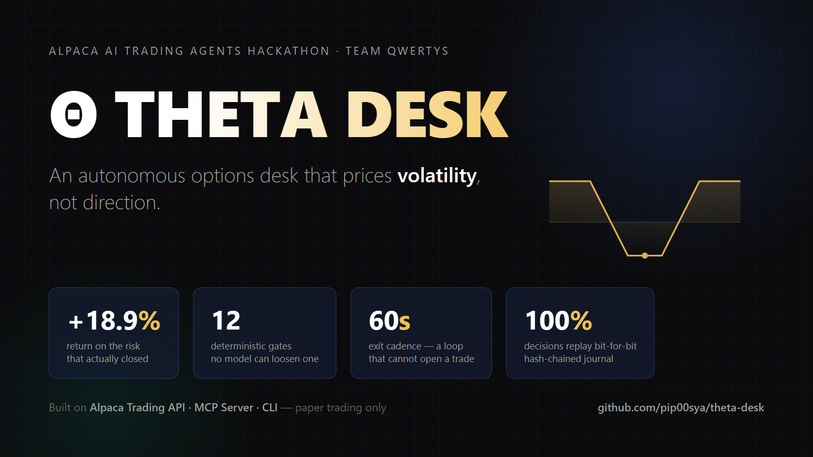

# Θ THETA DESK



**An autonomous options desk on Alpaca that prices volatility, not direction.**
Team Qwertys — [Alpaca AI Trading Agents Hackathon](https://lablab.ai/ai-hackathons/alpaca-ai-trading-agents-hackathon) (lablab.ai), Aug 28 – Sep 4, 2026.

<p>
<a href="https://theta-desk.streamlit.app"><b>▶ Live dashboard</b></a> ·
<a href="https://theta-desk.streamlit.app/?judge=1">Judge mode</a> ·
<a href="WRITEUP.md">One-page write-up</a> ·
<a href="DEVLOG.md">DEVLOG — 18 documented self-corrections</a> ·
<a href="API-FEEDBACK.md">Feedback for the Alpaca team</a>
</p>

Paper account **PA39C10YAMYQ** · paper trading only · hypothetical results · not investment advice.

---

## The thesis

Over a five-day competition, price prediction is a coin flip. THETA DESK doesn't
flip coins: it prices the **volatility risk premium** — ATM implied volatility
from Alpaca's free option chain against 20-day realized volatility — and trades
the gap. Rich vol → sell defined-risk iron condors. Cheap vol → buy convexity.

**Day-one proof it's a system, not a story:** the plan said "sell condors".
The live signal said realized vol was *above* implied — premium was cheap.
The agent went against its authors' plan and bought puts instead. That book
is what you see green on the dashboard.

## LLMs decide whether it's wise. Code decides whether it's allowed.

Four LLM roles run every 15-minute cycle — a Vol Analyst (Claude), a blind
Second Opinion (Mistral via Featherless — cross-provider, so disagreement is
real), a News Vetoer (Qwen, cheap enough for every tick), and a Risk Officer
(Claude) whose only job is to attack the trade. They argue, veto and shrink
size. **They cannot loosen a single one of 18 deterministic risk gates.**

The central gate is the desk's veto right: before any order, the **entire
book plus the candidate** is repriced over a ±20% underlying grid at the
judging horizon, under base and stressed-vol scenarios, each leg off its own
underlying's spot. Worst case breaches budget → the order is never sent, and
the refusal is journaled with the full grid. It is a client-side
implementation of the same worst-case principle as Alpaca's universal spread
rule for options margin — applied one step earlier.

## Everything replays. Every number regenerates.

- **Hash-chained journal** — every decision line carries the SHA-256 of the
  previous one; edit a byte and `verify-journal` fails
- **Bit-for-bit replay** — every tick stores its inputs; `tools/replay.py`
  re-runs the deterministic pipeline over the whole week (currently 100% MATCH)
- **Claims reconciler** — `tools/reconcile.py` recomputes every number in
  [WRITEUP.md](WRITEUP.md) from the journal, no credentials required
- **Live ablation** — three counterfactual books run on identical inputs:
  the strategy without gates, without its hedge, and a naive
  "read a headline, buy an option" baseline. The dollar value of every
  design decision, measured, not asserted

## Architecture

```
scheduler (mirrors the exchange session, survives sleep & battery)
  └─ L1 data        chain + greeks + IV (free indicative feed), 20d RV, per-underlying spots
  └─ L2 desk        4 LLM roles argue/veto/size — never compute
  └─ L3 selector    deterministic regime map -> iron condor / long vega / QQQ fallback
  └─ L4-L5 gates    18 pure-Python gates incl. ★ portfolio payoff simulator
  └─ L6 executor    mleg limit via Alpaca CLI (signed prices), idempotent ids, REST fallback
  └─ L7 manager     profit targets · realization policy · NFP de-risk · halt-not-flatten
  └─ L8 audit       hash journal · snapshots · replay · reconcile · evidence archive
  └─ shadows        ablation books + naive baseline
```

Sizing is **earned**: risk budgets grow only from realized gains (worst-case
6%→8% of equity, long-premium sleeve 1.5%→2.5%). The agent earns the right
to take risk.

## Built with the whole Alpaca stack

| Piece | Use |
|---|---|
| Trading API | execution, positions, activities, portfolio history |
| Market Data API | option chain with greeks + IV on the **free** indicative feed |
| **MCP Server** | the research loop (Claude Code drove the whole build through it) |
| **CLI** | the autonomous order path: `alpaca api POST /v2/orders`, exit codes, idempotent `client_order_id` |
| mleg orders | 2–4 legs, lowest-terms ratios, **signed limit prices** (see DEVLOG #12 — found the hard way) |

## Reproduce everything

```bash
pip install -e ".[dashboard,dev]"
python -m pytest tests -q            # 58 tests
python tools/demo_week.py            # offline simulated week, zero credentials
python tools/replay.py               # decisions reproduce bit-for-bit
python tools/reconcile.py            # every write-up number regenerates
streamlit run dashboard/app.py       # the glass box, locally
```

Live paper trading additionally needs `.env` (see `.env.example`) — and the
process refuses to start unless the base URL is the paper host (fail-closed,
`safety.py`).

## Honest notes

- Built, red-teamed, debugged and operated end-to-end by AI (Claude), with
  every self-correction documented in [DEVLOG.md](DEVLOG.md) — including an
  mleg sign-convention bug that a weekend acceptance test caught before it
  could hurt, and the pair of labeled test orders that neutralized it (−$6)
- The cloud dashboard renders a committed data snapshot (refreshed daily);
  live keys never leave the machine
- Paper fills are optimistic vs live markets (no impact, no queue); stated
  in the write-up

MIT License.
